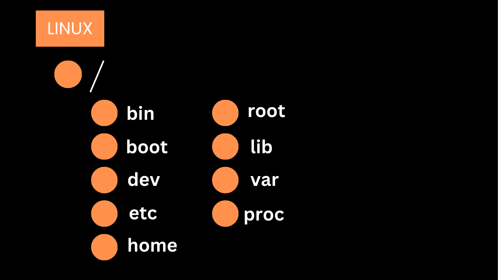

# Linux File System

The Linux file system is a complex structure that organizes and manages files on a Linux operating system. It's based on a hierarchical directory structure, starting from the root directory (`/`) and branching into various other directories that contain essential files and data. Below is a brief explanation of some of the key directories in a Linux file system

## How Everything in Linux is Considered a File
In Linux, the principle "everything is a file" means that all system components—data, directories, devices, and even processes—are represented as files. This simplifies interaction with the system.

### 1. `/` (Root Directory)
- The root directory is the top-most directory in a Linux file system. All other directories and files are organized under this directory. The root directory is represented by a single forward slash (`/`).

### 2. `/bin` (Binaries)
- The `/bin` directory contains essential user command binaries (executables) that are needed for system operation in both single-user and multi-user environments. Examples include basic commands like `ls`, `cp`, `mv`, `rm`, etc.

### 3. `/boot` (Boot Files)
- The `/boot` directory holds the files necessary for booting the system, including the Linux kernel and other bootloader files. Without the files in this directory, the system cannot boot.

### 4. `/dev` (Device Files)
- The `/dev` directory contains special device files that represent hardware devices, such as disks, terminals, and other input/output devices. These files provide an interface to the kernel for interacting with hardware components.

### 5. `/etc` (Configuration Files)
- The `/etc` directory contains all the system-wide configuration files and shell scripts that are used to initialize the system settings. Examples include the `/etc/passwd` file for user account information and `/etc/fstab` for file system mounting information.

### 6. `/home` (User Home Directories)
- The `/home` directory contains a subdirectory for each user on the system. Each user’s personal files, configurations, and data are stored in their respective subdirectory under `/home`. For example, `/home/john` would be the home directory for the user `john`.

### 7. `/root` (Root User’s Home Directory)
- The `/root` directory is the home directory for the root user, who is the superuser or administrator of the system. This directory is separate from `/home` because it is reserved specifically for administrative tasks.

### 8. `/lib` (Shared Libraries)
- The `/lib` directory contains shared library files (similar to DLL files in Windows) that are required by the binaries in `/bin` and `/sbin`. These libraries are essential for system boot and normal operation.

### 9. `/var` (Variable Files)
- The `/var` directory contains files that are expected to grow in size, such as log files, mail spools, and temporary files. Examples include `/var/log` for system logs and `/var/spool` for print queues and mail spools.

### 10. `/proc` (Process Information)
- The `/proc` directory is a pseudo-filesystem that provides a mechanism for the kernel to send information to processes. It contains information about the system and running processes, such as memory usage, hardware configuration, and kernel version. The files in `/proc` are virtual files, meaning they do not occupy disk space.

