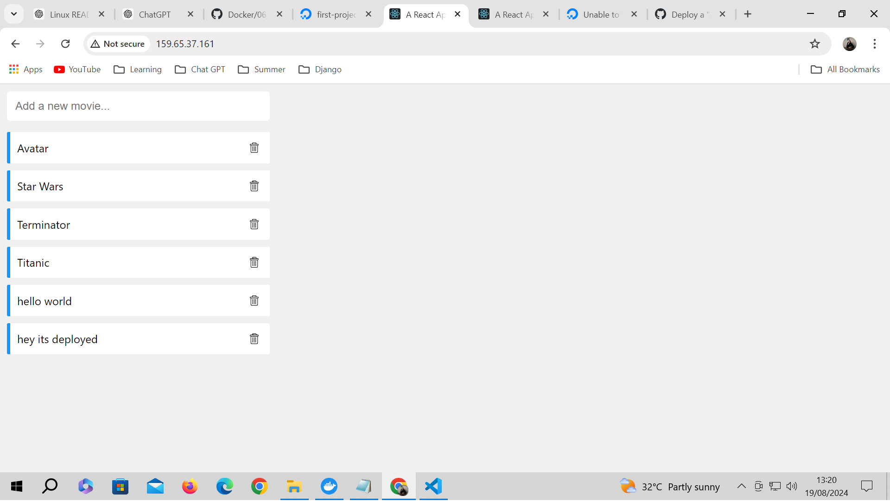

# 🚀 Deploying the Application with Docker Compose

Deploying a multi-container application using Docker Compose on a Virtual Private Server (VPS) is a straightforward yet powerful way to manage your services. This guide will walk you through the process, covering everything from setting up your environment to running your application in production.

## 🛠️ Step 1: Check Existing Docker Machines

First, let’s check the Docker machines that are currently set up.

### Command:
```bash
docker-machine ls
```

### 🖥️ Output:
```plaintext
NAME     ACTIVE   DRIVER         STATE     URL                        SWARM   DOCKER     ERRORS
vidly2   -        digitalocean   Running   tcp://159.65.37.161:2376           v19.03.9
```

This output shows that the `vidly2` machine is running on DigitalOcean with the given IP address and Docker version.

## 🛠️ Step 2: Set Up Your Docker Environment

Next, configure your shell to interact with the Docker machine.

### Command:
```bash
docker-machine env vidly2
```

### 🖥️ Output:
```plaintext
You can further specify your shell with either 'cmd' or 'powershell' with the --shell flag.

SET DOCKER_TLS_VERIFY=1
SET DOCKER_HOST=tcp://159.65.37.161:2376
SET DOCKER_CERT_PATH=C:\Users\aaaa\.docker\machine\machines\vidly2
SET DOCKER_MACHINE_NAME=vidly2
SET COMPOSE_CONVERT_WINDOWS_PATHS=true
REM Run this command to configure your shell:
REM     @FOR /f "tokens=*" %i IN ('"C:\Users\aaaa\bin\docker-machine.exe" env vidly2') DO @%i
```

### Configuring the Shell:
To configure your shell, run the following command:

```bash
eval $(docker-machine.exe env vidly2 --shell bash)
```

This command sets the necessary environment variables to interact with the Docker machine. You can verify the settings using:

### Command:
```bash
env | grep DOCKER
```

### 🖥️ Output:
```plaintext
DOCKER_TLS_VERIFY=1
DOCKER_CERT_PATH=C:\Users\aaaa\.docker\machine\machines\vidly2
DOCKER_MACHINE_NAME=vidly2
DOCKER_HOST=tcp://159.65.37.161:2376
```

## 🛠️ Step 3: Verify Docker Images

Before deploying, let's check the existing Docker images on the machine.

### Command:
```bash
docker images
```

### 🖥️ Output:
```plaintext
REPOSITORY   TAG       IMAGE ID   CREATED   SIZE
```

It seems there are no images currently available on the machine.

## 🛠️ Step 4: Deploy the Application

Now, let's deploy the application using Docker Compose. We'll use the `docker-compose.prod.yml` file, which is configured for production.

### Command:
```bash
docker-compose -f docker-compose.prod.yml up -d
```

### 🛠️ Building and Running the Containers:
As the command runs, it will pull necessary images, build others, and start the containers.

### 🖥️ Pulling Database Image Output:
```plaintext
[+] Running 13/13
 ✔ db Pulled                                                                                           12.1s 
   ✔ 58690f9b18fc Pull complete                                                                         0.4s 
   ✔ b51569e7c507 Pull complete                                                                         0.2s 
   ✔ da8ef40b9eca Pull complete                                                                         0.2s 
   ✔ fb15d46c38dc Pull complete                                                                         0.3s 
   ✔ a0dc15b16822 Pull complete                                                                         0.3s 
   ✔ b7a3e92f19af Pull complete                                                                         0.5s 
   ✔ ed4a7b863fa1 Pull complete                                                                         0.5s 
   ✔ a58b030ea8e4 Pull complete                                                                         0.5s 
   ✔ 6aa1ba699846 Pull complete                                                                         0.6s 
   ✔ ebc52c729dca Pull complete                                                                         0.6s 
   ✔ 52e8c440d4d6 Pull complete                                                                         1.3s 
   ✔ 22b97876323d Pull complete                                                                         0.5s 
```

### 🛠️ Building API and Web Images:
The build process includes downloading the base images, installing dependencies, and copying files.

### 🖥️ Building API Output:
```plaintext
[+] Building 41.3s (12/12)                                                                    docker:default 
 => [api auth] sharing credentials for registry-1.docker.io                                             0.0s 
 => [api 1/6] FROM docker.io/library/node:14.16.0-alpine3.13@sha256:2c51dc462a02f15621e7486774d36d048a  4.0s 
 => => resolve docker.io/library/node:14.16.0-alpine3.13@sha256:2c51dc462a02f15621e7486774d36d048a2722  0.0s 
 => => sha256:2c51dc462a02f15621e7486774d36d048a27225d581374b002b8477a79a59b4b 1.43kB / 1.43kB          0.0s 
 => => sha256:aaa14c316ef4221bace52357a6a9633238ed575dbb8ae372df959d7939ce6366 1.16kB / 1.16kB          0.0s 
 => => sha256:50bfd284aa0daf62e9fe0f08db4905a4f9eb9456ad5773e259ae18d31ec44f6e 6.73kB / 6.73kB          0.0s 
 => => sha256:ca3cd42a7c9525f6ce3d64c1a70982613a8235f0cc057ec9244052921853ef15 2.81MB / 2.81MB          0.1s 
 => => sha256:cf8dc363e30fa6d6a24fafe0c593ea0447c0fbe2ec3f1a7e6c68fa8836d1556c 35.91MB / 35.91MB        0.5s 
 => => sha256:074ae49463c4f38ae0a7b325d47187e75bc59b07639d2e312d35b29aca1ee4e7 2.36MB / 2.36MB          0.1s 
 => => extracting sha256:ca3cd42a7c9525f6ce3d64c1a70982613a8235f0cc057ec9244052921853ef15               0.4s 
 => => sha256:48fd78e4b5321d188146bc79a6b38f93ad9bc0958939a8ecbde58aebed044c7b 282B / 282B              0.2s 
 => => extracting sha256:cf8dc363e30fa6d6a24fafe0c593ea0447c0fbe2ec3f1a7e6c68fa8836d1556c               2.7s 
 => => extracting sha256:074ae49463c4f38ae0a7b325d47187e75bc59b07639d2e312d35b29aca1ee4e7               0.2s 
 => => extracting sha256:48fd78e4b5321d188146bc79a6b38f93ad9bc0958939a8ecbde58aebed044c7b               0.0s 
```

### 🖥️ Building Web Output:
```plaintext
[+] Building 179.2s (25/25) FINISHED                                                          docker:default 
 => [api internal] load build definition from Dockerfile                                                1.1s 
 => => transferring dockerfile: 217B                                                                    0.9s 
 => [api internal] load .dockerignore                                                                   1.1s 
 => => transferring context: 53B                                                                        0.9s 
 => [web internal] load metadata for docker.io/library/node:14.16.0-alpine3.13                          1.2s 
 => [api auth] sharing credentials for registry-1.docker.io                                             0.0s 
 => CACHED [web build-stage 1/6] FROM docker.io/library/node:14.16.0-alpine3.13@sha256:2c51dc462a02f15  4.0s 
 => => resolve docker.io/library/node:14.16.0-alpine3.13@sha256:2c51dc462a02f15621e7486774d36d048a2722  0.0s 
 => => sha256:2c51dc462a02f15621e7486774d36d048a27225d

581374b002b8477a79a59b4b 1.43kB / 1.43kB          0.0s 
 => => sha256:aaa14c316ef4221bace52357a6a9633238ed575dbb8ae372df959d7939ce6366 1.16kB / 1.16kB          0.0s 
 => => sha256:50bfd284aa0daf62e9fe0f08db4905a4f9eb9456ad5773e259ae18d31ec44f6e 6.73kB / 6.73kB          0.0s 
 => => sha256:ca3cd42a7c9525f6ce3d64c1a70982613a8235f0cc057ec9244052921853ef15 2.81MB / 2.81MB          0.1s 
 => => sha256:cf8dc363e30fa6d6a24fafe0c593ea0447c0fbe2ec3f1a7e6c68fa8836d1556c 35.91MB / 35.91MB        0.5s 
 => => sha256:074ae49463c4f38ae0a7b325d47187e75bc59b07639d2e312d35b29aca1ee4e7 2.36MB / 2.36MB          0.1s 
 => => extracting sha256:ca3cd42a7c9525f6ce3d64c1a70982613a8235f0cc057ec9244052921853ef15               0.4s 
 => => sha256:48fd78e4b5321d188146bc79a6b38f93ad9bc0958939a8ecbde58aebed044c7b 282B / 282B              0.2s 
 => => extracting sha256:cf8dc363e30fa6d6a24fafe0c593ea0447c0fbe2ec3f1a7e6c68fa8836d1556c               2.7s 
 => => extracting sha256:074ae49463c4f38ae0a7b325d47187e75bc59b07639d2e312d35b29aca1ee4e7               0.2s 
 => => extracting sha256:48fd78e4b5321d188146bc79a6b38f93ad9bc0958939a8ecbde58aebed044c7b               0.0s 
```

### 🖥️ Running Containers Output:
```plaintext
[+] Running 5/5
 ✔ Network 08_deploy_the_applications_default  Created                                                  0.3s 
 ✔ Volume "08_deploy_the_applications_vidly"   Created                                                  0.2s 
 ✔ Container 08_deploy_the_applications-db-1   Started                                                  1.0s 
 ✔ Container 08_deploy_the_applications-api-1  Started                                                  0.7s 
 ✔ Container 08_deploy_the_applications-web-1  Started                                                  0.7s 
```
## Update Dockerfile.prod 
```sh
FROM node:14.16.0-alpine3.13 AS build-stage
WORKDIR /app
COPY package*.json ./
RUN npm install
COPY . .
RUN npm run build

FROM nginx:1.12-alpine 
COPY --from=build-stage /app/build /usr/share/nginx/html
EXPOSE 80
ENTRYPOINT [ "nginx", "-g", "daemon off;" ]
```

also update Dockerfile.prod under frontend directory
```sh
FROM node:14.16.0-alpine3.13 AS build-stage
WORKDIR /app
COPY package*.json ./
RUN npm install
COPY . .
ENV REACT_APP_API_URL=http://159.65.37.161:3001/api
RUN npm run build

FROM nginx:1.12-alpine 
COPY --from=build-stage /app/build /usr/share/nginx/html
EXPOSE 80
ENTRYPOINT ["nginx", "-g", "daemon off;" ]
```
## Rebuild 
```sh
docker-compose -f docker-compose.prod.yml up -d --build
```

# Deployed


## 🎯 Conclusion

You have successfully deployed your multi-container application using Docker Compose on a DigitalOcean VPS. The application is now running, and you can access it through the configured ports. 🥳
